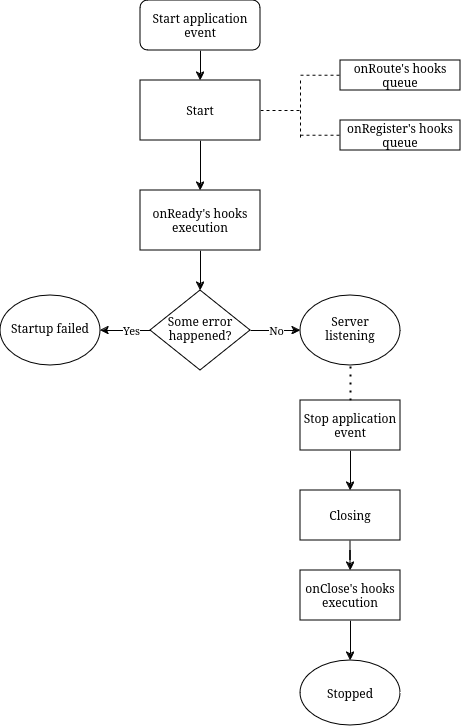

# Accelerating Server-Side Development with Fastify by Manuel Spigolon , Maksim Sinik , Matteo Collina

最重要的两个部分：Routes 和 Hooks。

## What Is Fastify?

app = http.Server

plugin

Request = http.IncomingMessage

Reply = http.ServerResponse

应用生命循环 application lifecycle

以下是 Fastify 的 application hooks（监听应用生命循环的事件），它们可以拦截并控制应用的启动进程（路由插件的初始化，应用的打开和关闭）。更具体来讲，一个 hook 就是一个系统内发生了一个事件时运行的函数：

- onRoute: 当应用运行到添加路由这一步时运行
- onRegister: 当一个新的上下文创建时
- onReady: 当应用准备好接收外部请求时
- onClose: 当应用停止时

请求生命循环 request lifecycle

如果不需要进行一些异步操作（文件读写、数据库读取写入）的话，用回调方式能够提高一些性能。

## The Plugin System and the Boot Process

## Working with Routes

## Exploring Hooks

## Exploring Validation and Serialization

## Project Structure and Configuration Management

## Building a RESTful API

## Authentication, Authorization, and File Handling

## Application Testing

## Deployment and Process Monitoring for a Healthy Application

## Meaningful Application Logging

## From a Monolith to Microservices

## Performance Assessment and Improvement

## Developing a GraphQL API

## Type-Safe Fastify
